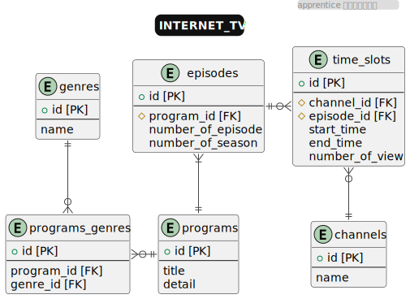

# インターネットTV（提出quest）

## ステップ1 テーブル設計

### programs（番組）
番組を格納するテーブル。
| カラム名    | データ型     | NULL | キー    | 初期値 | AUTO INCREMENT |
| ----------- | ------------ | ---- | ------- | ------ | -------------- |
| id          | bigint(20)   |      | PRIMARY |        | YES            |
| title       | varchar(100) |      | INDEX   |        |                |
| description | varchar(255) | YES  |         |        |                |


### genres（ジャンル）
ジャンルを格納するテーブル。
| カラム名 | データ型    | NULL | キー    | 初期値 | AUTO INCREMENT |
| -------- | ----------- | ---- | ------- | ------ | -------------- |
| id       | bigint(20)  |      | PRIMARY |        | YES            |
| name     | varchar(20) |      |         |        |                |


### program_genres（番組-ジャンル）
番組とジャンルは多対多の関係のため中間テーブルを作成。
| カラム名   | データ型   | NULL | キー    | 初期値 | AUTO INCREMENT |
| ---------- | ---------- | ---- | ------- | ------ | -------------- |
| id         | bigint(20) |      | PRIMARY |        | YES            |
| program_id | bigint(20) |      | FOREIGN |        |                |
| genre_id   | bigint(20) |      | FOREIGN |        |                |


### episodes（エピソード）
番組のエピソードとシーズンを格納。本来ならここに動画視聴用のURLも格納する。
| カラム名          | データ型     | NULL | キー    | 初期値 | AUTO INCREMENT |
| ----------------- | ------------ | ---- | ------- | ------ | -------------- |
| id                | bigint(20)   |      | PRIMARY |        | YES            |
| program_id        | bigint(10)   |      | FOREIGN |        |                |
| title             | VARCHAR(100) |      |         |        |                |
| description       | VARCHAR(100) |      |         |        |                |
| time              | VARCHAR(100) |      |         |        |                |
| date              | VARCHAR(100) |      |         |        |                |
| number_of_episode | bigint(10)   | YES  |         |        |                |
| number_of_season  | bigint(10)   | YES  |         |        |                |


### channels（チャンネル）
チャンネルを格納。
| カラム名 | データ型    | NULL | キー    | 初期値 | AUTO INCREMENT |
| -------- | ----------- | ---- | ------- | ------ | -------------- |
| id       | bigint(20)  |      | PRIMARY |        | YES            |
| name     | varchar(20) |      |         |        |                |


### time_slots（放送枠）
放送開始時間、終了時間、視聴数を格納。
| カラム名        | データ型   | NULL | キー    | 初期値 | AUTO INCREMENT |
| --------------- | ---------- | ---- | ------- | ------ | -------------- |
| id              | bigint(20) |      | PRIMARY |        | YES            |
| channel_id      | bigint(20) |      | FOREIGN |        |                |
| episode_id      | bigint(20) |      | FOREIGN |        |                |
| start_time      | date       |      |         |        |                |
| end_time        | date       |      |         |        |                |
| number_of_views | date       |      |         |        |                |


### ER図



## ステップ2 テーブル作成

### MySQLへログイン
```shell
$ mysql -u ユーザー名 -p
パスワード入力
```

### データベース作成
```sql
mysql> CREATE DATABASE internet_tv;
mysql> USE internet_tv;
```

### テーブル作成
```sql
CREATE TABLE genres (
  id INT(11) NOT NULL AUTO_INCREMENT PRIMARY KEY,
  name VARCHAR(255) NOT NULL
);

CREATE TABLE programs (
  id INT(11) NOT NULL AUTO_INCREMENT PRIMARY KEY,
  title VARCHAR(255) NOT NULL,
  description TEXT NULL
);

CREATE TABLE programs_genres (
  id INT(11) NOT NULL AUTO_INCREMENT PRIMARY KEY,
  program_id INT(11) NOT NULL,
  genre_id INT(11) NOT NULL,
  FOREIGN KEY (program_id) REFERENCES programs(id),
  FOREIGN KEY (genre_id) REFERENCES genres(id)
);

CREATE TABLE episodes (
  id INT(11) NOT NULL AUTO_INCREMENT PRIMARY KEY,
  program_id INT(11) NOT NULL,
  title VARCHAR(255) NOT NULL,
  description TEXT NULL,
  number_of_episode INT(11) NULL,
  number_of_season INT(11) NULL,
  FOREIGN KEY (program_id) REFERENCES programs(id) 
);

CREATE TABLE channels (
  id INT(11) NOT NULL AUTO_INCREMENT PRIMARY KEY,
  name VARCHAR(255) NOT NULL
);

CREATE TABLE time_slots (
  id INT(11) NOT NULL AUTO_INCREMENT PRIMARY KEY,
  channel_id INT(11) NOT NULL,
  episode_id INT(11) NOT NULL,
  start_time datetime NOT NULL,
  end_time datetime NOT NULL,
  number_of_views INT(11) NOT NULL DEFAULT 0,
  FOREIGN KEY (channel_id) REFERENCES channels(id),
  FOREIGN KEY (episode_id) REFERENCES episodes(id)
);

```

### サンプルデータ生成
[データ生成用sql](internet_tv.sql)

```sql
mysql> source ./internet_tv.sql;
```


## ステップ3 データ抽出クエリ
1. よく見られているエピソードを知りたいです。エピソード視聴数トップ3のエピソードタイトルと視聴数を取得してください

```sql
SELECT episodes.title AS episode_title, number_of_views
FROM programs 
INNER JOIN episodes ON programs.id = episodes.program_id 
INNER JOIN time_slots ON episodes.id = time_slots.episode_id 
ORDER BY time_slots.number_of_views DESC 
LIMIT 3;
```

出力
```
+-----------------------------------+-----------------+
| episode_title                     | number_of_views |
+-----------------------------------+-----------------+
| 未来の探求者                      |          999201 |
| K-POPウェイブ                     |          996213 |
| ベトナムのフォーグルメ            |          996056 |
+-----------------------------------+-----------------+
3 rows in set (0.06 sec)
```

2. よく見られているエピソードの番組情報やシーズン情報も合わせて知りたいです。エピソード視聴数トップ3の番組タイトル、シーズン数、エピソード数、エピソードタイトル、視聴数を取得してください

```sql
SELECT programs.title AS program_title, number_of_season, number_of_episode, episodes.title AS episode_title, number_of_views FROM programs
INNER JOIN episodes ON programs.id = episodes.program_id 
INNER JOIN time_slots ON episodes.id = time_slots.episode_id 
ORDER BY time_slots.number_of_views DESC 
LIMIT 3;
```

出力
```
+----------------------------------------+------------------+-------------------+-----------------------------------+-----------------+
| program_title                          | number_of_season | number_of_episode | episode_title                     | number_of_views |
+----------------------------------------+------------------+-------------------+-----------------------------------+-----------------+
| 未来の探求者                           |             NULL |              NULL | 未来の探求者                      |          999201 |
| K-POPウェイブ                          |             NULL |              NULL | K-POPウェイブ                     |          996213 |
| 美味しい冒険: 世界の味巡り             |             NULL |                 8 | ベトナムのフォーグルメ            |          996056 |
+----------------------------------------+------------------+-------------------+-----------------------------------+-----------------+
3 rows in set (0.01 sec)
```

3. 本日の番組表を表示するために、本日、どのチャンネルの、何時から、何の番組が放送されるのかを知りたいです。本日放送される全ての番組に対して、チャンネル名、放送開始時刻(日付+時間)、放送終了時刻、シーズン数、エピソード数、エピソードタイトル、エピソード詳細を取得してください。なお、番組の開始時刻が本日のものを本日放送される番組とみなすものとします

```sql
SELECT name, start_time, end_time, number_of_season, number_of_episode, title, description FROM channels 
INNER JOIN time_slots ON channels.id = time_slots.channel_id 
INNER JOIN episodes ON time_slots.episode_id = episodes.id 
WHERE time_slots.start_time >= TIMESTAMP("2023-10-28 00:00:00")
AND time_slots.start_time < DATE_ADD(TIMESTAMP("2023-10-29 00:00:00"), INTERVAL 1 DAY)
ORDER BY channels.id ASC, time_slots.start_time ASC;
```

出力
```
+-----------+---------------------+---------------------+------------------+-------------------+--------------------------------------+-----------------------------------------------------------------------------------------------------------------+
| name      | start_time          | end_time            | number_of_season | number_of_episode | title                                | description                                                                                                     |
+-----------+---------------------+---------------------+------------------+-------------------+--------------------------------------+-----------------------------------------------------------------------------------------------------------------+
| ドラマ    | 2023-10-28 00:05:00 | 2023-10-28 00:35:00 |                2 |                 2 | 失踪者の帰還                         | 失踪していた人物が帰還し、新たな謎が明らかになります。                                                          |
| ドラマ    | 2023-10-28 02:39:00 | 2023-10-28 03:31:00 |                2 |                 3 | 暗号の謎                             | 暗号が登場し、主人公はその謎を解読して事件の核心に迫ります。                                                    |
| ドラマ    | 2023-10-28 04:10:00 | 2023-10-28 05:09:00 |                2 |                 4 | 幻の財宝                             | 伝説の幻の財宝を巡る冒険が始まり、主人公はその行方を追います。                                                  |
| ドラマ    | 2023-10-28 06:50:00 | 2023-10-28 07:22:00 |                2 |                 5 | 仲間の裏切り                         | 仲間が裏切りに関与し、主人公は友情の試練に立ち向かいます。                                                      |
| ドラマ    | 2023-10-28 08:23:00 | 2023-10-28 09:06:00 |                2 |                 6 | 魔法の力                             | 魔法の力が登場し、主人公は魔法の秘密を解明しようとします。                                                      |
| ドラマ    | 2023-10-28 10:35:00 | 2023-10-28 11:07:00 |                2 |                 7 | 二重スパイ                           | 二重スパイの存在が明らかになり、主人公は陰謀を暴きます。                                                        |
| ドラマ    | 2023-10-28 12:56:00 | 2023-10-28 13:47:00 |                2 |                 8 | 時間の逆襲                           | 時間に逆襲され、主人公は時間を戻すために闘います。                                                              |
| ドラマ    | 2023-10-28 14:46:00 | 2023-10-28 15:25:00 |                2 |                 9 | 決戦の幕開け                         | 物語のクライマックスで、主人公は敵との決戦に臨み、最終的な真相に迫ります。                                      |
| ドラマ    | 2023-10-28 16:29:00 | 2023-10-28 17:14:00 |                2 |                10 | ミステリータイムの終わり             | シーズン2の結末で、全ての謎が明らかになり、物語が幕を閉じます。                                                 |
| ドラマ    | 2023-10-28 18:51:00 | 2023-10-28 19:29:00 |             NULL |              NULL | ドラマの舞台裏                       | ドラマシリーズの制作と俳優のインタビュー                                                                        |
| ドラマ    | 2023-10-28 20:05:00 | 2023-10-28 21:03:00 |             NULL |              NULL | ドラマの魅力                         | ドラマの登場人物と感情豊かなストーリーライン                                                                    |
| ドラマ    | 2023-10-28 22:51:00 | 2023-10-28 23:24:00 |             NULL |              NULL | ドラマの魅力                         | ドラマの魅力と登場人物たちの物語                                                                                |
| ドラマ    | 2023-10-29 00:29:00 | 2023-10-29 01:10:00 |             NULL |              NULL | 街のドラマ                           | 日常生活の中で繰り広げられる人間ドラマを描くドラマシリーズ。                                                    |
| ドラマ    | 2023-10-29 02:44:00 | 2023-10-29 03:19:00 |                1 |                 1 | 秘密の扉                             | 探偵が新たな事件に巻き込まれ、秘密の扉を開ける手がかりを探します。                                              |
| ドラマ    | 2023-10-29 04:48:00 | 2023-10-29 05:31:00 |                1 |                 2 | 謎の失踪                             | 主人公は友人の失踪事件に取り組み、謎めいた事件の真相を追求します。                                              |
| ドラマ    | 2023-10-29 06:25:00 | 2023-10-29 07:21:00 |                1 |                 3 | 影の追跡者                           | 謎の追跡者が登場し、主人公を狙います。彼らは彼を追い詰めます。                                                  |
| ドラマ    | 2023-10-29 08:09:00 | 2023-10-29 08:40:00 |                1 |                 4 | 幽霊の告白                           | 幽霊の姿を見たという目撃証言があり、主人公は幽霊の謎を解き明かします。                                          |
| ドラマ    | 2023-10-29 11:00:00 | 2023-10-29 11:39:00 |                1 |                 5 | 密室の謎                             | 密室殺人事件が発生し、主人公はその謎を解くために奔走します。                                                    |
| ドラマ    | 2023-10-29 12:17:00 | 2023-10-29 12:56:00 |                1 |                 6 | 遺産の秘密                           | 遺産を巡る闘いが勃発し、主人公は遺産の秘密を明らかにしようとします。                                            |
| ドラマ    | 2023-10-29 14:07:00 | 2023-10-29 14:49:00 |                1 |                 7 | 裏切りの影                           | 友情が裏切りによって崩れ、主人公は裏切り者を見つけ出すために努力します。                                        |
| ドラマ    | 2023-10-29 16:19:00 | 2023-10-29 17:06:00 |                1 |                 8 | 時空の謎                             | 時空の異常が発生し、主人公は過去と未来を行き来しながら謎を解き明かします。                                      |
| ドラマ    | 2023-10-29 18:43:00 | 2023-10-29 19:30:00 |                1 |                 9 | 最後の闘い                           | 物語のクライマックスで、主人公は最後の闘いに挑み、真相に迫ります。                                              |
| ドラマ    | 2023-10-29 21:00:00 | 2023-10-29 21:50:00 |                1 |                10 | 秘密の解明                           | シーズン1の結末で、謎が解明され、新たな謎が明らかになります。                                                   |
| ドラマ    | 2023-10-29 22:42:00 | 2023-10-29 23:36:00 |                2 |                 1 | 新たな事件の幕開け                   | シーズン2が始まり、主人公は新たな事件に立ち向かう覚悟を決めます。                                               |
+-----------+---------------------+---------------------+------------------+-------------------+--------------------------------------+-----------------------------------------------------------------------------------------------------------------+
24 rows in set (0.00 sec)
```

4. ドラマというチャンネルがあったとして、ドラマのチャンネルの番組表を表示するために、本日から一週間分、何日の何時から何の番組が放送されるのかを知りたいです。ドラマのチャンネルに対して、放送開始時刻、放送終了時刻、シーズン数、エピソード数、エピソードタイトル、エピソード詳細を本日から一週間分取得してください
（データの都合上、本日を「"2023-10-22 00:00:00"」とします。）
```sql
SELECT name AS channel_name, start_time, end_time, number_of_season, number_of_episode, title, description FROM episodes 
INNER JOIN time_slots ON episodes.id =  time_slots.episode_id 
INNER JOIN channels ON time_slots.channel_id = channels.id 
WHERE channels.name = 'ドラマ'
AND start_time < DATE_ADD("2023-10-22 00:00:00", INTERVAL 1 WEEK)
AND start_time >= "2023-10-22 00:00:00"
ORDER BY start_time ASC;
```

出力
```
+--------------+---------------------+---------------------+------------------+-------------------+--------------------------------------+-----------------------------------------------------------------------------------------------------------------+
| channel_name | start_time          | end_time            | number_of_season | number_of_episode | title                                | description                                                                                                     |
+--------------+---------------------+---------------------+------------------+-------------------+--------------------------------------+-----------------------------------------------------------------------------------------------------------------+
| ドラマ       | 2023-10-23 02:04:00 | 2023-10-23 02:34:00 |                1 |                 1 | 秘密の扉                             | 探偵が新たな事件に巻き込まれ、秘密の扉を開ける手がかりを探します。                                              |
| ドラマ       | 2023-10-23 04:23:00 | 2023-10-23 04:57:00 |                1 |                 2 | 謎の失踪                             | 主人公は友人の失踪事件に取り組み、謎めいた事件の真相を追求します。                                              |
| ドラマ       | 2023-10-23 06:55:00 | 2023-10-23 07:35:00 |                1 |                 3 | 影の追跡者                           | 謎の追跡者が登場し、主人公を狙います。彼らは彼を追い詰めます。                                                  |
| ドラマ       | 2023-10-23 08:03:00 | 2023-10-23 08:58:00 |                1 |                 4 | 幽霊の告白                           | 幽霊の姿を見たという目撃証言があり、主人公は幽霊の謎を解き明かします。                                          |
| ドラマ       | 2023-10-23 10:59:00 | 2023-10-23 11:31:00 |                1 |                 5 | 密室の謎                             | 密室殺人事件が発生し、主人公はその謎を解くために奔走します。                                                    |
| ドラマ       | 2023-10-23 12:26:00 | 2023-10-23 12:57:00 |                1 |                 6 | 遺産の秘密                           | 遺産を巡る闘いが勃発し、主人公は遺産の秘密を明らかにしようとします。                                            |
| ドラマ       | 2023-10-23 14:12:00 | 2023-10-23 14:56:00 |                1 |                 7 | 裏切りの影                           | 友情が裏切りによって崩れ、主人公は裏切り者を見つけ出すために努力します。                                        |
| ドラマ       | 2023-10-23 16:00:00 | 2023-10-23 16:53:00 |                1 |                 8 | 時空の謎                             | 時空の異常が発生し、主人公は過去と未来を行き来しながら謎を解き明かします。                                      |
| ドラマ       | 2023-10-23 18:45:00 | 2023-10-23 19:27:00 |                1 |                 9 | 最後の闘い                           | 物語のクライマックスで、主人公は最後の闘いに挑み、真相に迫ります。                                              |
| ドラマ       | 2023-10-23 20:13:00 | 2023-10-23 20:56:00 |                1 |                10 | 秘密の解明                           | シーズン1の結末で、謎が解明され、新たな謎が明らかになります。                                                   |
| ドラマ       | 2023-10-23 22:46:00 | 2023-10-23 23:26:00 |                2 |                 1 | 新たな事件の幕開け                   | シーズン2が始まり、主人公は新たな事件に立ち向かう覚悟を決めます。                                               |
| ドラマ       | 2023-10-24 00:27:00 | 2023-10-24 01:11:00 |                2 |                 2 | 失踪者の帰還                         | 失踪していた人物が帰還し、新たな謎が明らかになります。                                                          |
| ドラマ       | 2023-10-24 02:13:00 | 2023-10-24 03:12:00 |                2 |                 3 | 暗号の謎                             | 暗号が登場し、主人公はその謎を解読して事件の核心に迫ります。                                                    |
| ドラマ       | 2023-10-24 04:38:00 | 2023-10-24 05:35:00 |                2 |                 4 | 幻の財宝                             | 伝説の幻の財宝を巡る冒険が始まり、主人公はその行方を追います。                                                  |
| ドラマ       | 2023-10-24 06:59:00 | 2023-10-24 07:32:00 |                2 |                 5 | 仲間の裏切り                         | 仲間が裏切りに関与し、主人公は友情の試練に立ち向かいます。                                                      |
| ドラマ       | 2023-10-24 08:05:00 | 2023-10-24 08:46:00 |                2 |                 6 | 魔法の力                             | 魔法の力が登場し、主人公は魔法の秘密を解明しようとします。                                                      |
| ドラマ       | 2023-10-24 10:36:00 | 2023-10-24 11:20:00 |                2 |                 7 | 二重スパイ                           | 二重スパイの存在が明らかになり、主人公は陰謀を暴きます。                                                        |
| ドラマ       | 2023-10-24 12:44:00 | 2023-10-24 13:16:00 |                2 |                 8 | 時間の逆襲                           | 時間に逆襲され、主人公は時間を戻すために闘います。                                                              |
| ドラマ       | 2023-10-24 14:52:00 | 2023-10-24 15:29:00 |                2 |                 9 | 決戦の幕開け                         | 物語のクライマックスで、主人公は敵との決戦に臨み、最終的な真相に迫ります。                                      |
| ドラマ       | 2023-10-24 16:29:00 | 2023-10-24 17:24:00 |                2 |                10 | ミステリータイムの終わり             | シーズン2の結末で、全ての謎が明らかになり、物語が幕を閉じます。                                                 |
| ドラマ       | 2023-10-24 18:05:00 | 2023-10-24 18:43:00 |             NULL |              NULL | ドラマの舞台裏                       | ドラマシリーズの制作と俳優のインタビュー                                                                        |
| ドラマ       | 2023-10-24 20:56:00 | 2023-10-24 21:39:00 |             NULL |              NULL | ドラマの魅力                         | ドラマの登場人物と感情豊かなストーリーライン                                                                    |
| ドラマ       | 2023-10-24 22:11:00 | 2023-10-24 23:09:00 |             NULL |              NULL | ドラマの魅力                         | ドラマの魅力と登場人物たちの物語                                                                                |
| ドラマ       | 2023-10-25 00:19:00 | 2023-10-25 01:09:00 |             NULL |              NULL | 街のドラマ                           | 日常生活の中で繰り広げられる人間ドラマを描くドラマシリーズ。                                                    |
| ドラマ       | 2023-10-25 02:04:00 | 2023-10-25 02:37:00 |                1 |                 1 | 秘密の扉                             | 探偵が新たな事件に巻き込まれ、秘密の扉を開ける手がかりを探します。                                              |
| ドラマ       | 2023-10-25 04:03:00 | 2023-10-25 04:38:00 |                1 |                 2 | 謎の失踪                             | 主人公は友人の失踪事件に取り組み、謎めいた事件の真相を追求します。                                              |
| ドラマ       | 2023-10-25 06:09:00 | 2023-10-25 06:40:00 |                1 |                 3 | 影の追跡者                           | 謎の追跡者が登場し、主人公を狙います。彼らは彼を追い詰めます。                                                  |
| ドラマ       | 2023-10-25 08:30:00 | 2023-10-25 09:07:00 |                1 |                 4 | 幽霊の告白                           | 幽霊の姿を見たという目撃証言があり、主人公は幽霊の謎を解き明かします。                                          |
| ドラマ       | 2023-10-25 10:05:00 | 2023-10-25 10:44:00 |                1 |                 5 | 密室の謎                             | 密室殺人事件が発生し、主人公はその謎を解くために奔走します。                                                    |
| ドラマ       | 2023-10-25 12:05:00 | 2023-10-25 12:35:00 |                1 |                 6 | 遺産の秘密                           | 遺産を巡る闘いが勃発し、主人公は遺産の秘密を明らかにしようとします。                                            |
| ドラマ       | 2023-10-25 14:52:00 | 2023-10-25 15:35:00 |                1 |                 7 | 裏切りの影                           | 友情が裏切りによって崩れ、主人公は裏切り者を見つけ出すために努力します。                                        |
| ドラマ       | 2023-10-25 16:44:00 | 2023-10-25 17:16:00 |                1 |                 8 | 時空の謎                             | 時空の異常が発生し、主人公は過去と未来を行き来しながら謎を解き明かします。                                      |
| ドラマ       | 2023-10-25 18:06:00 | 2023-10-25 18:58:00 |                1 |                 9 | 最後の闘い                           | 物語のクライマックスで、主人公は最後の闘いに挑み、真相に迫ります。                                              |
| ドラマ       | 2023-10-25 20:14:00 | 2023-10-25 20:58:00 |                1 |                10 | 秘密の解明                           | シーズン1の結末で、謎が解明され、新たな謎が明らかになります。                                                   |
| ドラマ       | 2023-10-25 22:13:00 | 2023-10-25 23:10:00 |                2 |                 1 | 新たな事件の幕開け                   | シーズン2が始まり、主人公は新たな事件に立ち向かう覚悟を決めます。                                               |
| ドラマ       | 2023-10-26 00:08:00 | 2023-10-26 01:06:00 |                2 |                 2 | 失踪者の帰還                         | 失踪していた人物が帰還し、新たな謎が明らかになります。                                                          |
| ドラマ       | 2023-10-26 02:29:00 | 2023-10-26 03:17:00 |                2 |                 3 | 暗号の謎                             | 暗号が登場し、主人公はその謎を解読して事件の核心に迫ります。                                                    |
| ドラマ       | 2023-10-26 04:21:00 | 2023-10-26 05:15:00 |                2 |                 4 | 幻の財宝                             | 伝説の幻の財宝を巡る冒険が始まり、主人公はその行方を追います。                                                  |
| ドラマ       | 2023-10-26 06:27:00 | 2023-10-26 07:26:00 |                2 |                 5 | 仲間の裏切り                         | 仲間が裏切りに関与し、主人公は友情の試練に立ち向かいます。                                                      |
| ドラマ       | 2023-10-26 08:26:00 | 2023-10-26 09:12:00 |                2 |                 6 | 魔法の力                             | 魔法の力が登場し、主人公は魔法の秘密を解明しようとします。                                                      |
| ドラマ       | 2023-10-26 10:17:00 | 2023-10-26 11:01:00 |                2 |                 7 | 二重スパイ                           | 二重スパイの存在が明らかになり、主人公は陰謀を暴きます。                                                        |
| ドラマ       | 2023-10-26 12:42:00 | 2023-10-26 13:37:00 |                2 |                 8 | 時間の逆襲                           | 時間に逆襲され、主人公は時間を戻すために闘います。                                                              |
| ドラマ       | 2023-10-26 14:01:00 | 2023-10-26 14:43:00 |                2 |                 9 | 決戦の幕開け                         | 物語のクライマックスで、主人公は敵との決戦に臨み、最終的な真相に迫ります。                                      |
| ドラマ       | 2023-10-26 16:24:00 | 2023-10-26 16:59:00 |                2 |                10 | ミステリータイムの終わり             | シーズン2の結末で、全ての謎が明らかになり、物語が幕を閉じます。                                                 |
| ドラマ       | 2023-10-26 18:18:00 | 2023-10-26 19:18:00 |             NULL |              NULL | ドラマの舞台裏                       | ドラマシリーズの制作と俳優のインタビュー                                                                        |
| ドラマ       | 2023-10-26 20:36:00 | 2023-10-26 21:31:00 |             NULL |              NULL | ドラマの魅力                         | ドラマの登場人物と感情豊かなストーリーライン                                                                    |
| ドラマ       | 2023-10-26 22:56:00 | 2023-10-26 23:37:00 |             NULL |              NULL | ドラマの魅力                         | ドラマの魅力と登場人物たちの物語                                                                                |
| ドラマ       | 2023-10-27 00:25:00 | 2023-10-27 01:06:00 |             NULL |              NULL | 街のドラマ                           | 日常生活の中で繰り広げられる人間ドラマを描くドラマシリーズ。                                                    |
| ドラマ       | 2023-10-27 02:07:00 | 2023-10-27 02:53:00 |                1 |                 1 | 秘密の扉                             | 探偵が新たな事件に巻き込まれ、秘密の扉を開ける手がかりを探します。                                              |
| ドラマ       | 2023-10-27 04:55:00 | 2023-10-27 05:55:00 |                1 |                 2 | 謎の失踪                             | 主人公は友人の失踪事件に取り組み、謎めいた事件の真相を追求します。                                              |
| ドラマ       | 2023-10-27 06:53:00 | 2023-10-27 07:30:00 |                1 |                 3 | 影の追跡者                           | 謎の追跡者が登場し、主人公を狙います。彼らは彼を追い詰めます。                                                  |
| ドラマ       | 2023-10-27 08:23:00 | 2023-10-27 09:17:00 |                1 |                 4 | 幽霊の告白                           | 幽霊の姿を見たという目撃証言があり、主人公は幽霊の謎を解き明かします。                                          |
| ドラマ       | 2023-10-27 10:46:00 | 2023-10-27 11:19:00 |                1 |                 5 | 密室の謎                             | 密室殺人事件が発生し、主人公はその謎を解くために奔走します。                                                    |
| ドラマ       | 2023-10-27 12:15:00 | 2023-10-27 12:52:00 |                1 |                 6 | 遺産の秘密                           | 遺産を巡る闘いが勃発し、主人公は遺産の秘密を明らかにしようとします。                                            |
| ドラマ       | 2023-10-27 14:03:00 | 2023-10-27 14:51:00 |                1 |                 7 | 裏切りの影                           | 友情が裏切りによって崩れ、主人公は裏切り者を見つけ出すために努力します。                                        |
| ドラマ       | 2023-10-27 16:26:00 | 2023-10-27 17:26:00 |                1 |                 8 | 時空の謎                             | 時空の異常が発生し、主人公は過去と未来を行き来しながら謎を解き明かします。                                      |
| ドラマ       | 2023-10-27 18:49:00 | 2023-10-27 19:34:00 |                1 |                 9 | 最後の闘い                           | 物語のクライマックスで、主人公は最後の闘いに挑み、真相に迫ります。                                              |
| ドラマ       | 2023-10-27 20:24:00 | 2023-10-27 20:54:00 |                1 |                10 | 秘密の解明                           | シーズン1の結末で、謎が解明され、新たな謎が明らかになります。                                                   |
| ドラマ       | 2023-10-27 22:49:00 | 2023-10-27 23:48:00 |                2 |                 1 | 新たな事件の幕開け                   | シーズン2が始まり、主人公は新たな事件に立ち向かう覚悟を決めます。                                               |
| ドラマ       | 2023-10-28 00:05:00 | 2023-10-28 00:35:00 |                2 |                 2 | 失踪者の帰還                         | 失踪していた人物が帰還し、新たな謎が明らかになります。                                                          |
| ドラマ       | 2023-10-28 02:39:00 | 2023-10-28 03:31:00 |                2 |                 3 | 暗号の謎                             | 暗号が登場し、主人公はその謎を解読して事件の核心に迫ります。                                                    |
| ドラマ       | 2023-10-28 04:10:00 | 2023-10-28 05:09:00 |                2 |                 4 | 幻の財宝                             | 伝説の幻の財宝を巡る冒険が始まり、主人公はその行方を追います。                                                  |
| ドラマ       | 2023-10-28 06:50:00 | 2023-10-28 07:22:00 |                2 |                 5 | 仲間の裏切り                         | 仲間が裏切りに関与し、主人公は友情の試練に立ち向かいます。                                                      |
| ドラマ       | 2023-10-28 08:23:00 | 2023-10-28 09:06:00 |                2 |                 6 | 魔法の力                             | 魔法の力が登場し、主人公は魔法の秘密を解明しようとします。                                                      |
| ドラマ       | 2023-10-28 10:35:00 | 2023-10-28 11:07:00 |                2 |                 7 | 二重スパイ                           | 二重スパイの存在が明らかになり、主人公は陰謀を暴きます。                                                        |
| ドラマ       | 2023-10-28 12:56:00 | 2023-10-28 13:47:00 |                2 |                 8 | 時間の逆襲                           | 時間に逆襲され、主人公は時間を戻すために闘います。                                                              |
| ドラマ       | 2023-10-28 14:46:00 | 2023-10-28 15:25:00 |                2 |                 9 | 決戦の幕開け                         | 物語のクライマックスで、主人公は敵との決戦に臨み、最終的な真相に迫ります。                                      |
| ドラマ       | 2023-10-28 16:29:00 | 2023-10-28 17:14:00 |                2 |                10 | ミステリータイムの終わり             | シーズン2の結末で、全ての謎が明らかになり、物語が幕を閉じます。                                                 |
| ドラマ       | 2023-10-28 18:51:00 | 2023-10-28 19:29:00 |             NULL |              NULL | ドラマの舞台裏                       | ドラマシリーズの制作と俳優のインタビュー                                                                        |
| ドラマ       | 2023-10-28 20:05:00 | 2023-10-28 21:03:00 |             NULL |              NULL | ドラマの魅力                         | ドラマの登場人物と感情豊かなストーリーライン                                                                    |
| ドラマ       | 2023-10-28 22:51:00 | 2023-10-28 23:24:00 |             NULL |              NULL | ドラマの魅力                         | ドラマの魅力と登場人物たちの物語                                                                                |
+--------------+---------------------+---------------------+------------------+-------------------+--------------------------------------+-----------------------------------------------------------------------------------------------------------------+
71 rows in set (0.00 sec)
```

5. (advanced) 直近一週間で最も見られた番組が知りたいです。直近一週間に放送された番組の中で、エピソード視聴数合計トップ2の番組に対して、番組タイトル、視聴数を取得してください
（データの都合上、本日を「"2023-10-29 00:00:00"」とします。）
```sql
SELECT programs.title AS program_title, number_of_views FROM programs
INNER JOIN episodes ON programs.id = episodes.program_id 
INNER JOIN time_slots ON episodes.id = time_slots.episode_id 
WHERE time_slots.start_time >= DATE_ADD("2023-10-29 00:00:00", INTERVAL - 1 WEEK)
AND time_slots.start_time < "2023-10-29 00:00:00"
ORDER BY time_slots.number_of_views DESC
LIMIT 2;
```

出力
```
+--------------------+-----------------+
| program_title      | number_of_views |
+--------------------+-----------------+
| 未来の探求者       |          999201 |
| K-POPウェイブ      |          996213 |
+--------------------+-----------------+
2 rows in set (0.00 sec)
```

6. (advanced) ジャンルごとの番組の視聴数ランキングを知りたいです。番組の視聴数ランキングはエピソードの平均視聴数ランキングとします。ジャンルごとに視聴数トップの番組に対して、ジャンル名、番組タイトル、エピソード平均視聴数を取得してください。

各エピソードの平均視聴数

```sql

-- 番組ごとの平均視聴者数テーブル（WITH句で使い回し）
WITH avg_table AS (
SELECT programs.id AS program_id, programs.title AS program_title, FLOOR(AVG(number_of_views)) AS avg_views FROM genres
INNER JOIN programs_genres ON genres.id = programs_genres.genre_id
INNER JOIN programs ON programs_genres.program_id = programs.id
INNER JOIN episodes ON programs.id = episodes.program_id
INNER JOIN time_slots ON episodes.id = time_slots.episode_id
GROUP BY program_id
)

-- 番組ごとの平均視聴者数テーブルにジャンルを付与したテーブル
SELECT genres.name AS genre_name, avg_table.program_title AS program_title, avg_table.avg_views AS avg_views FROM genres
INNER JOIN programs_genres ON genres.id = programs_genres.genre_id
INNER JOIN avg_table ON programs_genres.program_id = avg_table.program_id

-- ジャンルごとの最大視聴者数と一致するカラムを抜き出す
WHERE avg_views IN (

-- ジャンルごとの最大視聴者数テーブル
  SELECT MAX(avg_views) FROM genres
  INNER JOIN programs_genres ON genres.id = programs_genres.genre_id
  INNER JOIN avg_table ON programs_genres.program_id = avg_table.program_id
  GROUP BY genres.id
)

ORDER BY genre_id;

```

出力
```
+----------+--------------------------+----------------------------------------------+-----------+
| genre_id | genre_name               | program_title                                | avg_views |
+----------+--------------------------+----------------------------------------------+-----------+
|        1 | アニメ                   | 魔法の学園物語: 魔法使いの冒険               |    812019 |
|        2 | バラエティ               | コメディの夜                                 |    674951 |
|        3 | 恋愛                     | 恋愛の魔法                                   |    618557 |
|        4 | 映画                     | アクションマニア                             |    571166 |
|        5 | ドラマ                   | ドラマの魅力                                 |    624753 |
|        6 | スポーツ                 | アスリートの挑戦                             |    740579 |
|        7 | ニュース                 | 今日のヘッドライン                           |    607070 |
|        9 | K-POP                    | K-POPの世界                                  |    575787 |
|       10 | 将棋                     | 将棋の攻防                                   |    570816 |
|       11 | 麻雀                     | 麻雀王者決定戦                               |    533245 |
|       12 | HIPHOP                   | HIPHOPバトル                                 |    796309 |
|       13 | 格闘                     | 格闘の舞台                                   |    502307 |
|       14 | ドキュメンタリー         | 未来の探求者                                 |    999201 |
|       15 | 音楽                     | 音楽の旅                                     |    881073 |
+----------+--------------------------+----------------------------------------------+-----------+
14 rows in set (0.01 sec)
```